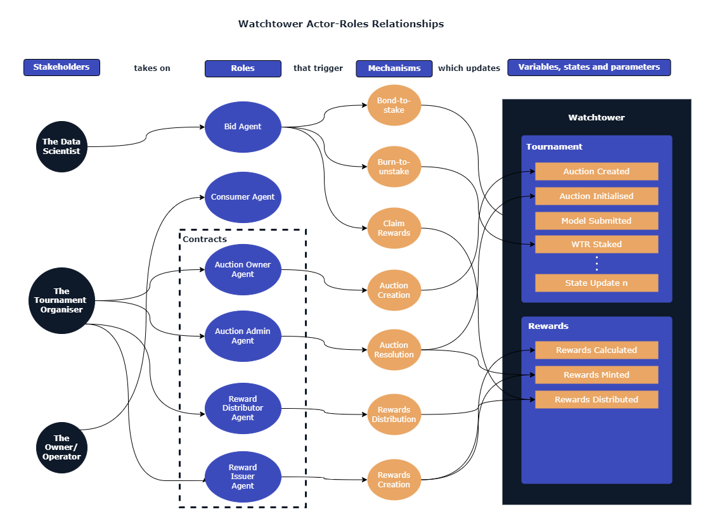

# 🧑‍🤝‍🧑 Actors and Roles

In this section we define the ecosystem actors (the term stakeholder is used interchangeably) and the roles they take on, in the Dora data science tournaments and by extension in the broader Watchtower ecosystem.

# Actors
There are three main actors for this version of Dora's data science tournaments. These are:

## The Data Scientist
The Data Scientists' role is to model and determine the appropriate Probability of Collision (Pc) and the Pc threshold of a conjunction event based on the data set provided to them.

## The Spacecraft Owner/Operator
The Spacecraft Owner/Operator (O/O)'s role is rather passive and just consumes data in this ecosystem. They have access to the Conjunctions Dashboard and can view the 2D and 3D Pc, threshold, speed and the distance between the object and the spacecraft. 

Its important to distinguish the difference of an owner and an operator:

A _**spacecraft owner**_ is an entity that commissions the manufacturing, service & operation of a satellite. They may not necessarily be involved in the process of manufacture, service & operation.

A _**spacecraft operator**_ is an entity that performs station keeping or using a term in SaaS platforms, dev ops or SRE, for satellites. Operators generally look after the satellite during its mission duration. They may not necessarily be involved in the process of determining any risk of collision such as the calculation of Pc.

However, in industry under the sub-sectors of Space Domain Awareness (SDA) & Space Situational Awareness (SSA) this term is used interchangeably to establish the stakeholder that is concerned about its satellite's operation.

## The Tournament Organiser
The Tournament Organiser is Watchtower (initially the Foundation and its multisig, with a transition to the WatchtowerDAO smart contract and its multisig as it progressively decentralises) which performs this via its Dora smart contracts which includes Auctions Controller, Rewards Issuer & Rewards Distributor contracts.

# Roles 
There is a one-to-many relationship between actors and the roles they play in the ecosystem. In the space industry for example, a spacecraft owner may or may not be the operator and also may or may not be involved in the process of determining collision risk. For example, when [Facebook launched their satellite with SpaceX](https://www.theguardian.com/science/2016/sep/01/mark-zuckerberg-spacex-explosion-africa-internet), they were the owners of the satellite but they most likely hired another company to operate it for them while SpaceX provided launch services for them. The European Space Agency (ESA) is an example where it is an owner and operator. They are not only owners of their satellites but they also operate them and perform the role of determining collision risk via their Space Debris Office.

## Role 1: The Bid Agent 
The Bid Agents are space debris scientists, professional data scientists, citizen scientists, data science students, companies that provide risk (Pc) assessment services, institutions such as space agencies and any other entity interested in participating in assessing the risk (Pc) of spacecraft collision.
Bidders have a private valuation of Pc and threshold for the tournament which they can provide as many times as they wish during the length of the tournament. They can (if they wish to) stake their confidence (using the WTR token) in their risk models during the length of the tournament. 

The Bid Agent:
* Shall be able to upload and submit their models
* Shall be able to stake their desired amount of tokens
* Shall be able to submit a confidence score on their private beliefs of risk
* Shall be able to claim any rewards they earn from winning the tournament

The Bid Agent mechanism actions:
* Upload and Submit Model
* Submit their confidence score
* Stake and unstake WTR token
* Claim Tournament Rewards

Example
A data scientist can upload and submit their risk model then can (if they choose to) stake any WTR tokens they have and submit a confidence score between 1 and 10.

## Role 2: The Consumer Agent (User)
The Consumer Agents are passive Owner/Operators (O/O) of the risk parameters determined from the tournament results (meta-Pc and meta-thresholds). The Consumer Agent can be satellite operators that are companies, institutions such as space agencies, student CubeSat projects and any other entities that rely on collision risk data.

Consumer Agents have access to a conjunctions dashboard that they can access by securing the Watchtower platform. They can secure Watchtower using a digital collectible and staking it.

The Consumer Agent:
* Shall be able to view probability of collision scores and their thresholds on the conjunctions dashboard.
* Shall be able to download the relevant CDM for the conjunction event.

Consumer Agent mechanism actions (not applicable in this version of Watchtower):
* Stake and unstake digital collectible
* Access and download any collision risk data required.

## Role 3: Auctions Owner Agent
The Auctions Owner is the controller of the overall auction and in this instance is the Foundation with the eventual transition to the DAO. This actor initialises the tournament, defines the start and timeframe of the tournament and any other parameters. Once the parameters are set, the auction contract is deployed but the tournament is not initiated.

The Auctions Owner:
* Shall be able to create a new tournament.
* Shall be able to define the parameters of the tournament.
* Shall transfer the tournament's moderation to the Auctions Administrator.
* May receive tokens to be issued for the tournament rewards.

Auction Owner mechanism actions:
* Deploy Auctions contract
* Transfer ownership of auction contract to Auction Admin address

## Role 4: Auctions Administrator Agent
The Auction Administrator is the moderator of the deployed auction. In this instance is the Foundation but this separation with the Owner leaves an option for further decentralisation where other participating entities have the option to moderate auctions based on winning an election. This actor initiates the tournament, terminate the tournament if necessary, determines if rewards are to be distributed or not.

The Auctions Administrator:
* Shall be able to initiate the tournament.
* Shall be able to abruptly terminate the tournament if necessary (event-driven).
* Shall be able to determine if rewards are to be distributed or not.

Auction Administrator mechanism actions:
* Call the commence tournament function.
* Subscribe to oracle feeds and event listeners.
* Call the terminate tournament function.
* Call the conclude and resolved tournament function.
* Get a mapping array of all winning addresses.
* Transfer ownership to rewards distributor contract

## Role 5: Rewards Distributor Agent
The Rewards Distributor distributes the reward after the conclusion and resolution of the tournament conditioned upon the Auction's administrator's permission. This actor calculates the rewards distribution using the confidence staking (s/c) ratio and initiates the transfer of the WTR token rewards based on the (s/c) ratio. 

The Rewards Distributor:
* Shall be able to calculate the rewards for a concluded and resolved tournament based on the s/c ratio.
* Shall be able to transfer reward tokens to winning addresses.

Rewards Distributor mechanism actions:
* Subscribe to event about the outcome (conclude & resolved) of the tournament.
* Call the calculate rewards function.
* Call the distribute rewards function.

## Role 6: Rewards Issuer Agent
The Rewards Issuer mints the necessary tokens required for the tournament based on the WTR issuance rate. The rewards issuer is a contract solely responsible to mint the tokens for the tournament. 

The Rewards Issuer:
* Shall be able to calculate the amount of tokens to mint
* Shall be able to mint calculated amount of tokens

Rewards Issuer mechanism actions:
* Subscribes to event trigger to initiate it role in the tournament
* Calls the calculate token amount function
* Calls the mint function

 
 

> _**Please Note** that there are other roles (between 4 and 5) involved in Dispute Resolution such as arbitration, verification and/or auditing which will not be included in this version of Dora. These roles will be implemented with the inclusion of the data oracle (Laika) to transition tournaments more real-time._