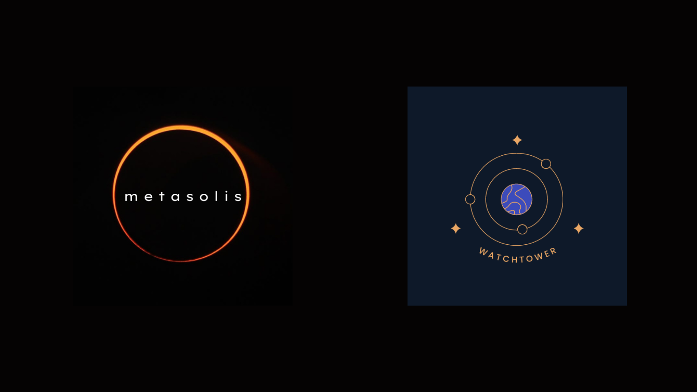

# Watchtower: A marketplace for spacecraft collision risk

Watchtower is a marketplace for spacecraft collision risk. These are markets that use an auctions mechanism to solve the problem of dilution and state estimation to help determine collision risk of space objects by crowdsourcing it via data science tournaments. These tournaments use skin-in-the-game mechanics to determine risk via measuring the confidence in the models' performance an individual data scientist makes via bidding mechanism on their submitted models.

The intention over the long term is to provide dynamic risk assessment (risk-adjusted bonding curve) of individual and/or collective conjunction events as a way to enable novel impact finance tooling and products. This is a _digital twin model_, which can aid in informing the implementation of Watchtower's auctions markets. 

We discuss the economic (token) engineering associated with building Watchtower's Dora Risk marketplace which is also referred to as the ecosystem. We lay out the following subsections pertaining to engineering these markets. 

1. The System, its goals and constraints
2. The Stakeholder/Actors and the roles they play in the ecosystem.
3. The Tournament and its Lifecycle to elaborate on the system's state transitions.
4. The Engineering Requirements 
5. The Mathematical Specification for the System's Design

## Implementation Partners

This project is a collaboration of mutual interest between the [Metasolis Labs](https://metasolis.co/), and [WatchtowerDAO](https://watchtower.world/). 

Motivations:
* **Metasolis Labs:** a s.t.e.a.m studio with a focus on building open-source web3 infrastructure for space ecosystems using rigorous design processes and tools.
* **WatchtowerDAO:** the foundation that enables the governance of Watchtower.

 

## Contact

The above model was designed and developed by [Metasolis Labs](https://metasolis.co) commissioned by WatchtowerDAO. If you are interested in using the model, supporting further development or have any other questions, reach out to us.

